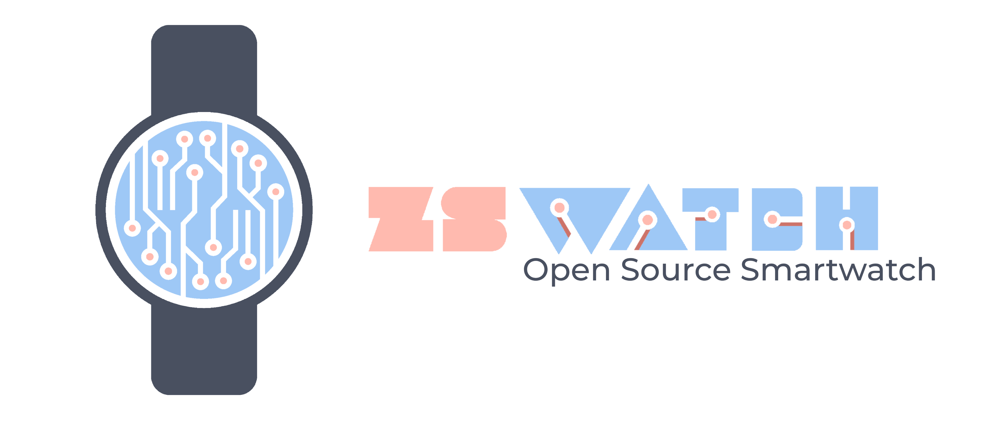

# ZSWatch Companion App

<p align="center">
  
</p>

<p align="center">
  <strong>Cross-platform companion app for the <a href="https://github.com/ZSWatch/ZSWatch">ZSWatch</a> open-source smartwatch</strong>
</p>

<p align="center">
  <a href="https://github.com/ZSWatch/ZSWatch-App/releases"></a>
  <a href="LICENSE"></a>
  
  
</p>

> **⚠️ Experimental / Work in Progress** — This app is under active development. Features may be incomplete, and APIs may change. Contributions and bug reports are welcome!

---

## Demo

<div>
  <a href="https://vimeo.com/1143868178">
    
  </a>
  <p><a href="https://vimeo.com/1143868178">▶ Watch the demo on Vimeo</a></p>
</div>

---

## What is this?

A Flutter companion app that connects to [ZSWatch](https://github.com/ZSWatch/ZSWatch) over BLE using the Gadgetbridge/BangleJS JSON protocol. It replaces Gadgetbridge on Android and provides features not available through standard iOS ANCS/AMS services.

### Features

| Feature | Android | iOS |
|---------|:-------:|:---:|
| BLE connection & auto-reconnect | ✅ | ✅ |
| Notification forwarding | ✅ | — (uses ANCS) |
| Music control | ✅ | — (uses AMS) |
| Firmware update (DFU) | ✅ | ✅ |
| LVGL resource upload | ✅ | ✅ |
| Health data (steps, heart rate) | ✅ | ✅ |
| Battery & connection analytics | ✅ | ✅ |
| GPS location relay | ✅ | ✅ |
| Weather sync | ✅ | ✅ |
| HTTP proxy for watch | ✅ | ✅ |
| Developer tools (logs, sensors) | ✅ | ✅ |
| Background BLE connection | ✅ | ✅ |

> On iOS, notification forwarding and media control are handled natively by the watch using Apple ANCS/AMS services — no app involvement needed.

---

## Download

### Android APK

Download the latest prebuilt APK from [GitHub Releases](https://github.com/ZSWatch/ZSWatch-App/releases).

### iOS

No prebuilt IPA is available. See [Building from Source](#building-from-source) to build and install on your device.

---

## Building from Source

### Prerequisites

- [Flutter SDK](https://docs.flutter.dev/get-started/install) 3.10+ (stable channel)
- [Android Studio](https://developer.android.com/studio) (for Android builds) or [Xcode](https://developer.apple.com/xcode/) 15+ (for iOS, macOS only)

Verify your setup:
```bash
flutter doctor -v
```

### Clone & Build

```bash
# Clone with submodules (includes MCUmgr fork)
git clone --recurse-submodules https://github.com/ZSWatch/ZSWatch-App.git

# Or if already cloned without submodules:
# git submodule update --init

cd ZSWatch-App/zswatch_app

# Install dependencies
flutter pub get

# Generate code (Drift database, Riverpod)
dart run build_runner build --delete-conflicting-outputs
```

### Android

```bash
# Debug (connected device)
flutter run

# Release APK
flutter build apk --release

# Output: build/app/outputs/flutter-apk/app-release.apk
```

### iOS

```bash
# Install CocoaPods (first time)
cd ios && pod install && cd ..

# Debug (connected device or simulator)
flutter run

# Release
flutter build ios --release
```

> **Note:** iOS release builds require an Apple Developer account and signing configuration in Xcode.

---

## Project Structure

```
ZSWatch-App/
├── zswatch_app/              # Flutter application
│   ├── lib/
│   │   ├── core/             # Constants, theme, utilities
│   │   ├── data/             # Database (Drift/SQLite), models, repositories
│   │   ├── services/         # BLE, protocol, DFU, notifications, media, health
│   │   ├── providers/        # Riverpod state management
│   │   └── ui/               # Screens and widgets
│   ├── android/              # Android platform code (Kotlin)
│   ├── ios/                  # iOS platform code
│   └── test/                 # Tests
├── specs/                    # Feature specifications
└── LICENSE
```

### Architecture

- **State management**: [Riverpod](https://riverpod.dev/) — providers in `providers/`, one per domain
- **Database**: [Drift](https://drift.simonbinder.eu/) (SQLite) with code generation
- **BLE protocol**: JSON-over-NUS (Nordic UART Service), Gadgetbridge/BangleJS format
- **DFU**: MCUmgr/SMP protocol via [mcumgr_flutter](https://github.com/ZSWatch/Flutter-nRF-Connect-Device-Manager)
- **Navigation**: [go_router](https://pub.dev/packages/go_router)

---

## Development

### Code Generation

After modifying Drift schemas or Riverpod annotations:
```bash
dart run build_runner build --delete-conflicting-outputs
```

### Linting & Formatting

```bash
flutter analyze
dart format .
```

### Tests

```bash
flutter test
```

---

## Related Projects

- **[ZSWatch Firmware](https://github.com/ZSWatch/ZSWatch)** — The smartwatch firmware (Zephyr RTOS)
- **[ZSWatch Docs](https://zswatch.dev)** — Documentation and getting started guides
- **[mcumgr_flutter fork](https://github.com/ZSWatch/Flutter-nRF-Connect-Device-Manager)** — MCUmgr plugin for DFU

---

## Contributing

1. Fork the repository
2. Create a feature branch: `git checkout -b feature/my-feature`
3. Make your changes and ensure `flutter analyze` passes
4. Run tests: `flutter test`
5. Commit and push: `git push origin feature/my-feature`
6. Open a Pull Request

---

## License

This project is licensed under the MIT License — see [LICENSE](LICENSE) for details.

---

## Support

- [GitHub Issues](https://github.com/ZSWatch/ZSWatch-App/issues) — Bug reports and feature requests
- [Discord](https://discord.gg/8XfNBmDfbY) — Community chat
- [zswatch.dev](https://zswatch.dev) — Documentation
